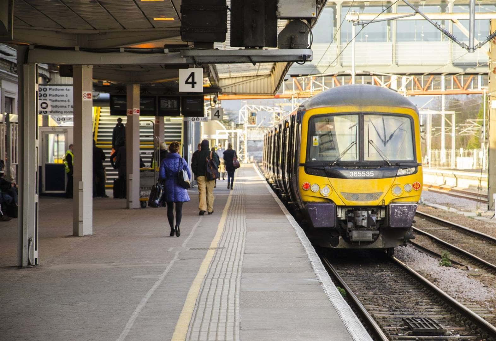

# Pushing decor

# Introduction

[https://github.com/vietphan1995/pushing-decor.git](https://github.com/vietphan1995/pushing-decor.git)

Pushing decor is a research to product project.

Pushing decor protects and navigate people in train station, out of rail track, rail track and street intersection. In extend, this can protect people from bus station, airport station, hotel/taxi station, stadium …

Basically, Pushing decor fence goes up and down automatically from under the ground, this fence goes up to protect people when the train is not in stop station, goes down when the train is in stop station. In intersection case, this fence goes up when the train goes through street, goes down when the train passes the intersection.

Pushing decor indicator act as tiles, these tiles are digital screen from the ground face for indicating people in station like vehicle code, pass door position, code, trip information, …

In extend, Pushing decor can protect/align/navigate crowd walking people line in station, wide space, …

